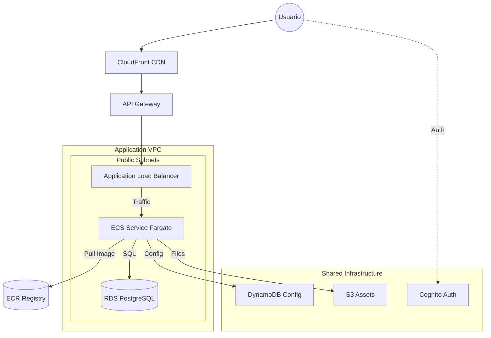

# Proyecto POC ECS: API NestJS en AWS ECS Fargate + Infraestructura Global

Este proyecto es una Prueba de Concepto (PoC) que demuestra cómo desplegar una aplicación backend moderna y escalable en Amazon Web Services (AWS) utilizando Infraestructura como Código (IaC).

El repositorio combina una API RESTful construida con **NestJS** y su infraestructura completa y modular definida en **Terraform**.

## 📂 Estructura del Proyecto

El repositorio se organiza en las siguientes secciones:

- **`api/`**: Código fuente de la aplicación backend.
  - Framework: [NestJS](https://nestjs.com/) (Node.js).
  - Funcionalidad: API REST con ejemplos de endpoints (`posts`, `posts-v2`).
  - Containerización: Incluye `Dockerfile` para su despliegue.

- **`terraform/`**: Definición de la infraestructura en AWS.
  - **`apps-infra/`**: Infraestructura de la aplicación (ECS, ALB, RDS, CloudFront). [Ver README](terraform/apps-infra/README.md)
  - **`general/`**: Infraestructura compartida y global (Cognito, S3 Assets, DynamoDB Config). [Ver README](terraform/general/README.md)

## 🏗 Arquitectura Global

La solución implementa una arquitectura serverless y modular.



## 🚀 Inicio Rápido (Local)

Para ejecutar la API en tu entorno local para desarrollo o pruebas:

### Prerrequisitos
- Node.js (v18 o superior)
- npm

### Pasos
1. Navega al directorio de la API:
   ```bash
   cd api
   ```

2. Instala las dependencias:
   ```bash
   npm install
   ```

3. Inicia el servidor de desarrollo:
   ```bash
   npm run start:dev
   ```

4. La API estará disponible en `http://localhost:3000`.

## ☁️ Despliegue en AWS

El despliegue se realiza mediante Terraform. Se recomienda seguir el orden de las capas de infraestructura:

1.  **Infraestructura General**: Despliega los recursos compartidos (Cognito, S3, DynamoDB).
    👉 [Ver Guía General](terraform/general/README.md)

2.  **Infraestructura de Aplicación**: Despliega la red, base de datos y el cluster ECS. Requiere un paso intermedio de construcción de imagen Docker.
    👉 [Ver Guía de Aplicación](terraform/apps-infra/README.md)

### Resumen del flujo de trabajo:

1.  `cd terraform/general` -> `terraform apply`
2.  `cd terraform/apps-infra` -> `terraform apply -target=...` (Red base)
3.  Build & Push imagen Docker (desde `api/`).
4.  `cd terraform/apps-infra` -> `terraform apply` (Despliegue completo)

## 🛠 Tecnologías Utilizadas

- **Backend**: TypeScript, NestJS.
- **Infraestructura**: Terraform (HCL).
- **Contenedores**: Docker.
- **Cloud (AWS)**:
    - **Compute**: ECS Fargate.
    - **Networking**: VPC, ALB, API Gateway, CloudFront.
    - **Data**: RDS (PostgreSQL), DynamoDB, S3.
    - **Auth**: Cognito.
