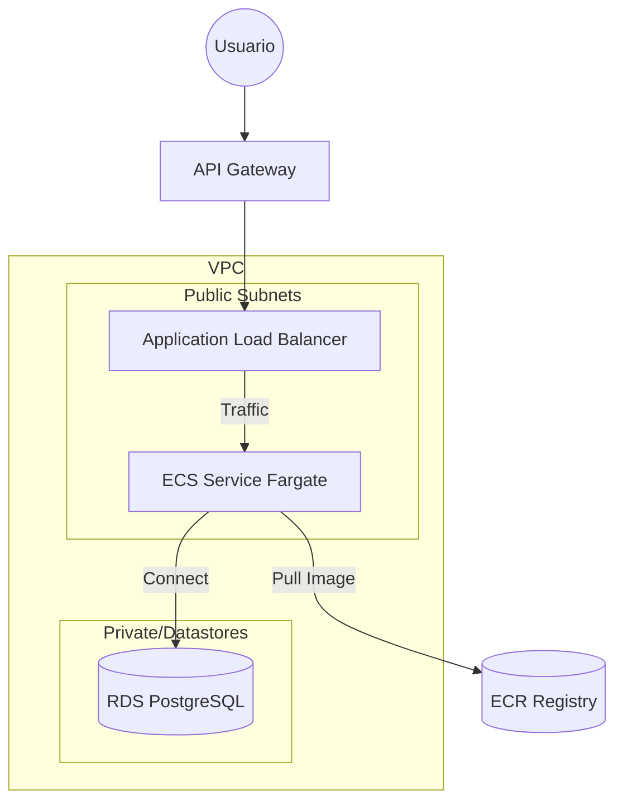

# Proyecto POC ECS: API NestJS en AWS ECS Fargate

Este proyecto es una Prueba de Concepto (PoC) que demuestra cómo desplegar una aplicación backend moderna y escalable en Amazon Web Services (AWS) utilizando Infraestructura como Código (IaC).

El repositorio combina una API RESTful construida con **NestJS** y su infraestructura completa definida en **Terraform**.

## 📂 Estructura del Proyecto

El repositorio se divide en dos componentes principales:

- **`poc-api/`**: Código fuente de la aplicación backend.
  - Framework: [NestJS](https://nestjs.com/) (Node.js).
  - Funcionalidad: API REST con un ejemplo de CRUD de "Posts" (`/posts`).
  - Persistencia: Ejemplo en memoria (preparado para conectar a BD).
  - Containerización: Incluye `Dockerfile` para su despliegue.

- **`terraform-api-ecs/`**: Definición de la infraestructura en AWS.
  - Herramienta: [Terraform](https://www.terraform.io/).
  - Recursos: VPC, Subnets, Security Groups, ALB, ECS Fargate, ECR, API Gateway y RDS.
  - Documentación: Contiene una guía detallada de despliegue.

## 🏗 Arquitectura

La solución implementa una arquitectura serverless basada en contenedores para alta disponibilidad y escalabilidad.



## 🚀 Inicio Rápido (Local)

Para ejecutar la API en tu entorno local para desarrollo o pruebas:

### Prerrequisitos
- Node.js (v18 o superior)
- npm

### Pasos
1. Navega al directorio de la API:
   ```bash
   cd poc-api
   ```

2. Instala las dependencias:
   ```bash
   npm install
   ```

3. Inicia el servidor de desarrollo:
   ```bash
   npm run start:dev
   ```

4. La API estará disponible en `http://localhost:3000`.
   - Endpoint de prueba: `GET http://localhost:3000/posts`

## ☁️ Despliegue en AWS

El despliegue está completamente automatizado mediante Terraform, pero requiere un proceso por fases (Red -> Imagen -> Aplicación).

**Consulta la guía detallada en:** 👉 [Documentación de Infraestructura (Terraform)](terraform-api-ecs/README.md)

### Resumen del proceso de despliegue:

1.  **Inicializar Infraestructura Base**: Crear VPC y repositorio ECR (`terraform apply -target=...`).
2.  **Build & Push**: Construir la imagen Docker de `poc-api` y subirla a ECR.
3.  **Desplegar Aplicación**: Aplicar el resto de la configuración de Terraform para lanzar el servicio ECS y el Balanceador.

## 🛠 Tecnologías Utilizadas

- **Backend**: TypeScript, NestJS.
- **Infraestructura**: Terraform (HCL).
- **Contenedores**: Docker.
- **Cloud (AWS)**:
    - **ECS Fargate**: Computación serverless para contenedores.
    - **ALB**: Balanceo de carga.
    - **API Gateway**: Punto de entrada HTTP.
    - **RDS**: Base de datos PostgreSQL (provisionada en IaC).
    - **ECR**: Registro de imágenes Docker.
