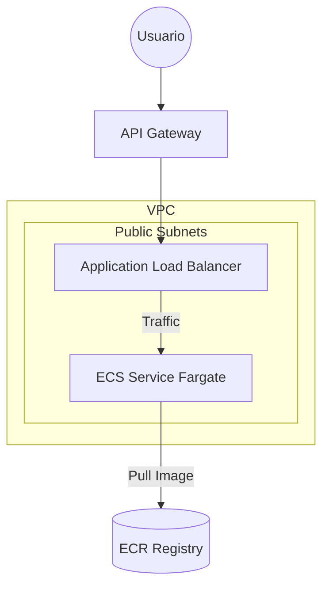
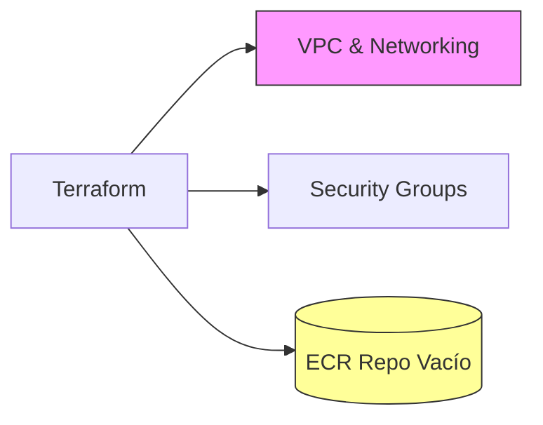
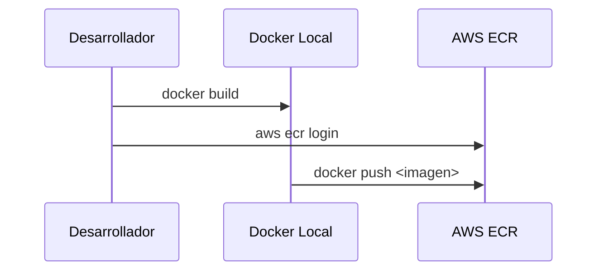
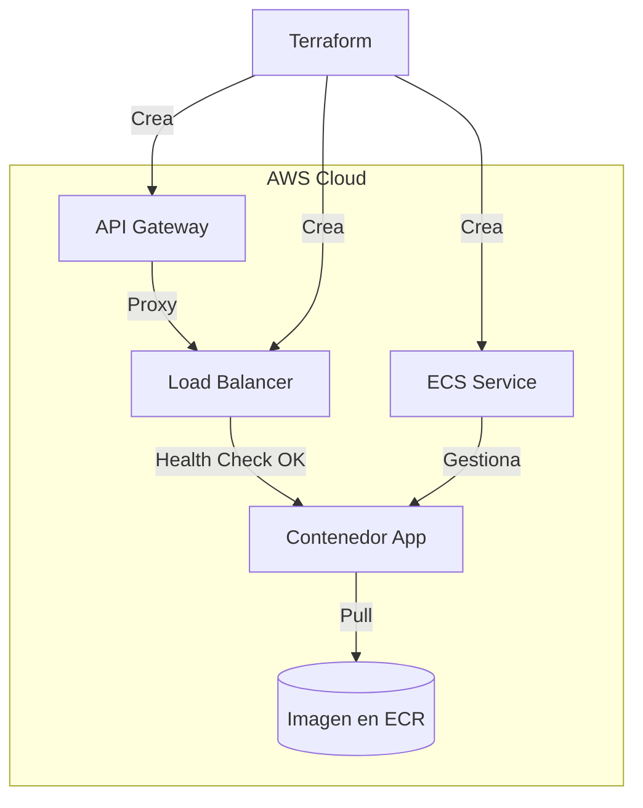

# Infraestructura Terraform: API + ECS Fargate + API Gateway

Este directorio contiene la definición de infraestructura como código (IaC) utilizando **Terraform** para desplegar la aplicación `poc-api` en Amazon Web Services (AWS).

La arquitectura implementada es una solución serverless basada en contenedores, diseñada para ser escalable y mantenible.



## 🏗 Arquitectura y Elementos Desplegados

A continuación se describen los componentes principales y su relevancia en el sistema:

| Componente | Archivo(s) | Descripción y Relevancia |
|------------|------------|--------------------------|
| **Networking (VPC)** | `networking.tf` | Crea una red privada virtual (`vpc`) con subredes públicas. Es la base donde viven los recursos. Se configuran tablas de ruteo y un Internet Gateway para permitir la comunicación con el exterior. |
| **Security Groups** | `security.tf` | Actúan como firewalls virtuales. <br>• `alb_sg`: Permite tráfico HTTP (80) desde cualquier lugar hacia el Balanceador.<br>• `ecs_sg`: Protege los contenedores, permitiendo tráfico **únicamente** desde el `alb_sg`. Esto asegura que nadie pueda acceder directo a los contenedores saltándose el balanceador. |
| **ECR (Registry)** | `ecr.tf` | **Elastic Container Registry**. Es el almacén donde se guardan las imágenes Docker de la aplicación. ECS descarga la imagen de aquí para iniciar los contenedores. |
| **ALB (Load Balancer)** | `alb.tf` | **Application Load Balancer**. Recibe el tráfico entrante y lo distribuye inteligentemente entre los contenedores disponibles. Realiza "health checks" para asegurar que solo envía tráfico a contenedores saludables. |
| **ECS Fargate** | `ecs.tf` | **Elastic Container Service**. Es el orquestador. Define la "Tarea" (cuánta CPU/RAM y qué imagen Docker usar) y el "Servicio" (mantiene el número deseado de copias de la app corriendo). Usa **Fargate**, por lo que no hay servidores que administrar. |
| **API Gateway** | `apigateway.tf` | **HTTP API**. Actúa como la puerta de entrada pública simplificada. En este diseño, funciona como un proxy que redirige las peticiones hacia el ALB. Provee una URL estable y puede integrarse con otros servicios AWS fácilmente. |
| **RDS PostgreSQL** | `rds.tf` | **Relational Database Service**. Base de datos gestionada PostgreSQL para la persistencia de datos. Configurada para ser accesible únicamente desde los servicios ECS. |

## 📋 Prerrequisitos

Antes de comenzar, asegúrate de tener instalado:

1.  **Terraform** (v1.0+): [Instalar Terraform](https://developer.hashicorp.com/terraform/downloads)
2.  **AWS CLI**: Configurado con credenciales válidas. [Instalar AWS CLI](https://docs.aws.amazon.com/cli/latest/userguide/getting-started-install.html)
3.  **Docker**: Necesario para construir y subir la imagen de la aplicación.

### Configuración de Variables

El archivo `variables.tf` define valores por defecto. Es importante revisar la variable `aws_profile`.

Puedes crear un archivo `terraform.tfvars` para sobreescribir valores sin modificar el código:

```hcl
# terraform.tfvars
aws_profile = "default"  # O el nombre de tu perfil AWS configurado
aws_region  = "us-east-1"
app_name    = "mi-api-custom"

# Configuración de base de datos (Opcional, tiene valores por defecto)
db_name     = "mi_db"
db_username = "mi_usuario"
db_password = "mi_password_secreto"
```

## 🚀 Guía de Despliegue Paso a Paso

Debido a que el servicio de ECS necesita que la imagen Docker exista *antes* de estabilizarse, recomendamos un despliegue en fases.

### Paso 1: Inicialización y Red Base

**Objetivo:** Preparar el terreno. Necesitamos la red (VPC) donde vivirán los servidores y el "garaje" (ECR) donde guardaremos la imagen Docker antes de intentar arrancar ningún coche (contenedor).



1.  Sitúate en el directorio `terraform-api-ecs`:
    ```bash
    cd terraform-api-ecs
    terraform init
    ```

2.  Despliega solo los recursos base:
    ```bash
    terraform apply -target=aws_ecr_repository.app -target=aws_vpc.main -target=aws_subnet.public -target=aws_security_group.alb_sg -target=aws_security_group.ecs_sg
    # Escribe 'yes' para confirmar
    ```

### Paso 2: Construcción y Publicación de la Imagen

**Objetivo:** Empaquetar tu aplicación y subirla a la nube. Sin esto, ECS no tendría qué ejecutar.



1.  **Obtén la URL del repositorio** (puedes verla en la salida del comando anterior o en la consola AWS).
2.  **Login en ECR**:
    ```bash
    aws ecr get-login-password --region us-east-1 --profile <TU_PERFIL> | docker login --username AWS --password-stdin <CUENTA_ID>.dkr.ecr.us-east-1.amazonaws.com
    ```
3.  **Construir y Subir**:
    Vuelve a la raíz del proyecto donde está el código fuente (`../`):
    ```bash
    cd ..
    docker build --platform linux/amd64 -t poc-api ./poc-api
    
    # Etiquetar con la URL del repositorio ECR creado en el paso 1
    docker tag poc-api:latest <ECR_REPO_URL>:latest
    
    # Subir la imagen
    docker push <ECR_REPO_URL>:latest
    ```

### Paso 3: Despliegue de la Aplicación (ECS + ALB)

**Objetivo:** Conectar todo. Ahora que la red existe y la imagen está lista, Terraform creará el balanceador y ordenará a ECS que arranque los contenedores usando esa imagen.

**¿Qué ocurre exactamente en este paso?**
1.  **Crea el ALB:** Terraform levanta el Load Balancer para empezar a recibir tráfico.
2.  **Define la Tarea:** Le dice a AWS "Quiero una tarea que use 0.25 vCPU, 0.5GB RAM y la imagen que acabamos de subir al ECR".
3.  **Lanza el Servicio:** ECS arranca la tarea (contenedor).
4.  **Conexión:** El contenedor inicia y se registra en el ALB. El ALB verifica si responde (Health Check).
5.  **Exposición:** Se crea el API Gateway apuntando al ALB.



1.  Vuelve al directorio de terraform:
    ```bash
    cd terraform-api-ecs
    terraform apply
    # Esto creará el ALB, el Cluster ECS, el Servicio Fargate y el API Gateway.
    ```

### Paso 4: Verificación

Al finalizar, Terraform mostrará outputs como `api_gateway_endpoint` y `rds_endpoint`.

Prueba tu API:

```bash
curl <api_gateway_endpoint>
# Deberías recibir un "Hello World!" o la respuesta raíz de tu API
```

Para conectar a la base de datos (desde una instancia dentro de la VPC o bastion host):
```bash
psql -h <rds_endpoint> -U postgres -d pocdb
```

## 🧹 Limpieza (Destrucción)

Para eliminar todos los recursos y detener la facturación:

```bash
terraform destroy
```
*Nota: El repositorio ECR está configurado con `force_delete = true`, por lo que borrará las imágenes almacenadas automáticamente.*
