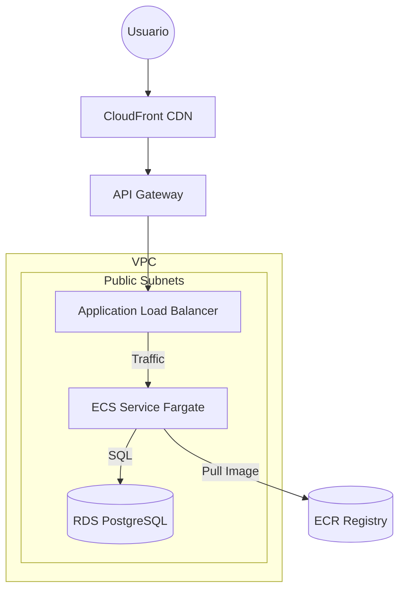

# Infraestructura Terraform: API + ECS Fargate + API Gateway + CloudFront

Este directorio contiene la definición de infraestructura como código (IaC) utilizando **Terraform** para desplegar la aplicación `poc-api` en Amazon Web Services (AWS).

La arquitectura implementada es una solución serverless basada en contenedores, diseñada para ser escalable, segura y de alto rendimiento.



## 🏗 Arquitectura y Elementos Desplegados

A continuación se describen los componentes principales y su relevancia en el sistema:

| Componente | Archivo(s) | Descripción y Relevancia |
|------------|------------|--------------------------|
| **Networking (VPC)** | `networking.tf` | Crea una red privada virtual (`vpc`) con subredes públicas. Es la base donde viven los recursos. Se configuran tablas de ruteo y un Internet Gateway para permitir la comunicación con el exterior. |
| **Security Groups** | `security.tf` | Actúan como firewalls virtuales. <br>• `alb_sg`: Permite tráfico HTTP (80) desde cualquier lugar.<br>• `ecs_sg`: Protege los contenedores, permitiendo tráfico **únicamente** desde el `alb_sg`.<br>• `rds_sg`: Protege la base de datos, permitiendo tráfico **únicamente** desde el `ecs_sg`. |
| **ECR (Registry)** | `ecr.tf` | **Elastic Container Registry**. Es el almacén donde se guardan las imágenes Docker de la aplicación. ECS descarga la imagen de aquí para iniciar los contenedores. |
| **ALB (Load Balancer)** | `alb.tf` | **Application Load Balancer**. Recibe el tráfico entrante y lo distribuye inteligentemente entre los contenedores disponibles. Realiza "health checks" para asegurar que solo envía tráfico a contenedores saludables. |
| **ECS Fargate** | `ecs.tf` | **Elastic Container Service**. Es el orquestador. Define la "Tarea" (CPU/RAM, imagen Docker, variables de entorno) y el "Servicio" (mantiene el número deseado de copias de la app). Usa **Fargate** (Serverless), y cuenta con **Auto Scaling** basado en CPU/Memoria. |
| **API Gateway** | `apigateway.tf` | **HTTP API**. Actúa como proxy que redirige las peticiones hacia el ALB. Provee una capa de abstracción adicional y facilidad de integración. |
| **CloudFront** | `cloudfront.tf` | **Content Delivery Network (CDN)**. Distribuye el contenido globalmente con baja latencia. Cachéa respuestas GET/HEAD y protege el origen. Termina SSL/TLS con certificados por defecto de AWS. |
| **RDS PostgreSQL** | `rds.tf` | **Relational Database Service**. Base de datos gestionada PostgreSQL 16.3. Configurada en subredes públicas pero protegida por Security Groups (no accesible directamente desde internet). |

## 📋 Prerrequisitos

Antes de comenzar, asegúrate de tener instalado:

1.  **Terraform** (v1.0+): [Instalar Terraform](https://developer.hashicorp.com/terraform/downloads)
2.  **AWS CLI**: Configurado con credenciales válidas. [Instalar AWS CLI](https://docs.aws.amazon.com/cli/latest/userguide/getting-started-install.html)
3.  **Docker**: Necesario para construir y subir la imagen de la aplicación.

### Configuración de Variables

El archivo `variables.tf` define valores por defecto. Es importante revisar la variable `aws_profile`.

Puedes crear un archivo `terraform.tfvars` para sobreescribir valores sin modificar el código:

```hcl
# terraform.tfvars
aws_profile = "default"  # O el nombre de tu perfil AWS configurado
aws_region  = "us-east-1"
app_name    = "mi-api-custom"

# Configuración de base de datos
db_name     = "mi_db"
db_username = "mi_usuario"
db_password = "mi_password_secreto"
```

## 🚀 Guía de Despliegue Paso a Paso

Debido a que el servicio de ECS necesita que la imagen Docker exista *antes* de estabilizarse, recomendamos un despliegue en fases.

### Paso 1: Inicialización y Red Base

**Objetivo:** Preparar la red (VPC) y el repositorio de imágenes (ECR).

1.  Sitúate en el directorio `apps-infra`:
    ```bash
    cd apps-infra
    terraform init
    ```

2.  Despliega solo los recursos base:
    ```bash
    terraform apply -target=aws_ecr_repository.app -target=aws_vpc.main -target=aws_subnet.public -target=aws_security_group.alb_sg -target=aws_security_group.ecs_sg
    # Escribe 'yes' para confirmar
    ```

### Paso 2: Construcción y Publicación de la Imagen

**Objetivo:** Empaquetar tu aplicación y subirla a ECR.

1.  **Login en ECR** (usa el comando que te da AWS o este genérico reemplazando valores):
    ```bash
    aws ecr get-login-password --region us-east-1 --profile <TU_PERFIL> | docker login --username AWS --password-stdin <CUENTA_ID>.dkr.ecr.us-east-1.amazonaws.com
    ```
2.  **Construir y Subir**:
    Vuelve a la raíz del proyecto (`../`) y ejecuta:
    ```bash
    docker build --platform linux/amd64 -t poc-api ./api
    
    # Etiquetar con la URL del repositorio ECR (ver output del paso 1 o consola)
    docker tag poc-api:latest <ECR_REPO_URL>:latest
    
    # Subir la imagen
    docker push <ECR_REPO_URL>:latest
    ```

### Paso 3: Despliegue Completo

**Objetivo:** Desplegar ALB, ECS, RDS, API Gateway y CloudFront.

1.  Vuelve al directorio de terraform (`apps-infra`):
    ```bash
    cd apps-infra
    terraform apply
    ```
    *Nota: La creación de la distribución de CloudFront puede tardar unos 5-10 minutos.*

### Paso 4: Verificación

Al finalizar, Terraform mostrará outputs importantes:

*   `api_gateway_endpoint`: URL del API Gateway.
*   `cloudfront_domain_name`: URL de la CDN (Recomendada para producción).
*   `rds_endpoint`: Host de la base de datos.

Prueba tu API:
```bash
curl https://<cloudfront_domain_name>/
# O usando el API Gateway directamente
curl <api_gateway_endpoint>
```

## 🧹 Limpieza (Destrucción)

Para eliminar todos los recursos y detener la facturación:

```bash
terraform destroy
```
*Nota: El repositorio ECR tiene `force_delete = true`, por lo que borrará las imágenes. Los snapshots de RDS se omiten (`skip_final_snapshot = true`).*
