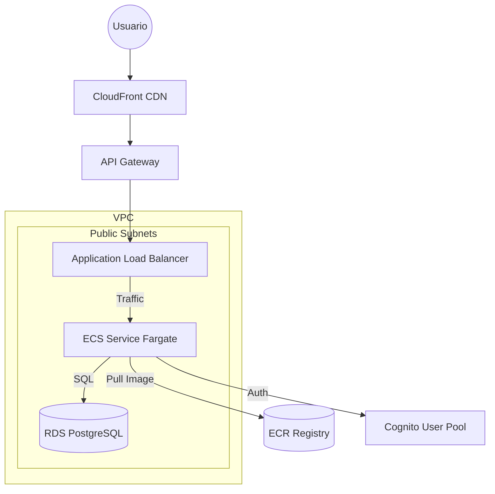

# Infraestructura Terraform: UMS App (ECS Fargate + API Gateway + CloudFront)

Este directorio contiene la definición de infraestructura como código (IaC) utilizando **Terraform** para desplegar la aplicación **UMS (User Management System)** en Amazon Web Services (AWS).

La arquitectura implementada es una solución serverless basada en contenedores, diseñada para ser escalable, segura y de alto rendimiento.



## 🏗 Arquitectura y Elementos Desplegados

A continuación se describen los componentes principales y su relevancia en el sistema:

| Componente | Archivo(s) | Descripción y Relevancia |
|------------|------------|--------------------------|
| **Networking (VPC)** | `networking.tf` | Crea una red privada virtual (`vpc`) con subredes públicas. Es la base donde viven los recursos. |
| **Security Groups** | `security.tf` | Actúan como firewalls virtuales. <br>• `alb_sg`: Permite tráfico HTTP (80).<br>• `ecs_sg`: Protege los contenedores (tráfico solo desde `alb_sg`).<br>• `rds_sg`: Protege la base de datos (tráfico solo desde `ecs_sg`). |
| **ECR (Registry)** | `ecr.tf` | Almacén de imágenes Docker. ECS descarga la imagen de aquí. |
| **ALB (Load Balancer)** | `alb.tf` | Distribuye el tráfico entre los contenedores. Realiza health checks en `/api/v1/health`. |
| **ECS Fargate** | `ecs.tf` | Orquestador de contenedores. Gestiona la tarea (CPU/RAM, Variables de Entorno) y el servicio. Ejecuta migraciones de base de datos al inicio si `RUN_MIGRATIONS` es true. |
| **RDS PostgreSQL** | `rds.tf` | Base de datos gestionada PostgreSQL 16.3. |

## 📋 Prerrequisitos

1.  **Terraform** (v1.0+)
2.  **AWS CLI** configurado.
3.  **Docker** instalado.
4.  **Infraestructura General (Cognito)**: Se requiere tener los valores de Cognito (User Pool ID, ARNs, Client IDs) para configurar la aplicación.

### Configuración de Variables

El archivo `variables.tf` define las variables. Para UMS, utilizamos el archivo de variables `workspaces/ums.tfvars`.

**Variables Importantes a Configurar en `workspaces/ums.tfvars`:**

```hcl
db_password = "..."           # Contraseña segura para la BD
user_pool_arn = "..."         # ARN del User Pool de Cognito
general_cognito_user_pool_id = "..."
general_cognito_client_id = "..."
admins_client_id = "..."      # Client ID para administradores
```

## 🚀 Guía de Despliegue

### Paso 1: Inicialización y Red Base

Prepara la red y el repositorio ECR.

```bash
cd apps-infra
terraform init
terraform apply -target=aws_ecr_repository.app -target=aws_vpc.main -target=aws_subnet.public -target=aws_security_group.alb_sg -target=aws_security_group.ecs_sg --var-file="workspaces/ums.tfvars"
# Confirma con 'yes'
```

### Paso 2: Construcción y Publicación de la Imagen (UMS)

Desde el directorio raíz del repositorio `ums`:

1.  **Login en ECR**:
    ```bash
    aws ecr get-login-password --region us-east-1 --profile <TU_PERFIL> | docker login --username AWS --password-stdin <CUENTA_ID>.dkr.ecr.us-east-1.amazonaws.com
    ```

2.  **Construir y Subir**:
    ```bash
    docker build --no-cache --platform linux/amd64 -t ums-app .
    
    # Etiquetar con la URL del repositorio ECR (obtenida en el paso 1)
    docker tag ums-app:latest <ECR_REPO_URL>:latest
    
    # Subir la imagen
    docker push <ECR_REPO_URL>:latest
    ```

### Paso 3: Despliegue Completo

Despliega el resto de la infraestructura (ECS, RDS, ALB, etc.).

```bash
terraform apply --var-file="workspaces/ums.tfvars"
```

*Nota: El despliegue de ECS incluye un "command override" para ejecutar las migraciones de base de datos automáticamente antes de iniciar la aplicación.*

### Paso 4: Verificación

Al finalizar, obtendrás las URLs de acceso:

*   `api_gateway_endpoint`
*   `cloudfront_domain_name`

Verifica el estado de salud:
```bash
curl https://<cloudfront_domain_name>/api/v1/health
```

## 🧹 Limpieza (Destrucción)

```bash
terraform destroy --var-file="workspaces/ums.tfvars"
```
