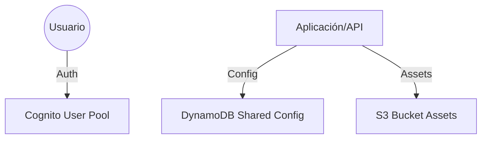

# Infraestructura Compartida (General)

Este directorio contiene la definición de infraestructura compartida para la plataforma, desplegada con **Terraform**. Estos recursos están diseñados para ser utilizados por múltiples servicios o aplicaciones dentro del ecosistema.

## 🏗 Arquitectura

Los recursos principales incluyen autenticación centralizada, almacenamiento de objetos y configuración compartida.



## 📦 Recursos Desplegados

| Recurso | Archivo(s) | Descripción |
|---------|------------|-------------|
| **Cognito User Pool** | `cognito.tf` | Servicio de identidad gestionado. Maneja registro y login de usuarios, verificación de email y JWTs. Configurado con políticas de contraseña y cliente web (sin secreto). |
| **DynamoDB Table** | `dynamodb.tf` | Tabla NoSQL para configuraciones compartidas o estado global. Utiliza modelo de facturación *Pay-per-request* y tiene TTL habilitado en `ExpirationTime`. Claves: `PK` (Partición) y `SK` (Ordenamiento). |
| **S3 Bucket** | `s3.tf` | Almacenamiento de objetos para assets compartidos. Configurado con versionado activado, encriptación AES256 por defecto y bloqueo total de acceso público (privado). |

## 📋 Prerrequisitos

*   **Terraform** (v1.0+)
*   **AWS CLI** configurado

## 🛠 Configuración y Uso

### Variables (`variables.tf`)

| Variable | Descripción | Default |
|----------|-------------|---------|
| `aws_region` | Región de despliegue | `us-east-1` |
| `aws_profile` | Perfil de AWS CLI | `default` |
| `environment` | Entorno (dev, staging, prod) | `dev` |
| `project_name` | Nombre del proyecto | `global-platform` |

### Despliegue

1.  Inicializar Terraform:
    ```bash
    terraform init
    ```

2.  Revisar el plan de ejecución:
    ```bash
    terraform plan
    ```

3.  Aplicar los cambios:
    ```bash
    terraform apply
    ```

### Outputs

Al finalizar, obtendrás identificadores útiles para integrar estos recursos con otras aplicaciones (como `apps-infra`):

*   `cognito_user_pool_id`: ID del User Pool.
*   `cognito_client_id`: Client ID para la app frontend/web.
*   `dynamodb_table_name`: Nombre de la tabla de configuración.
*   `s3_bucket_name`: Nombre del bucket de assets.

